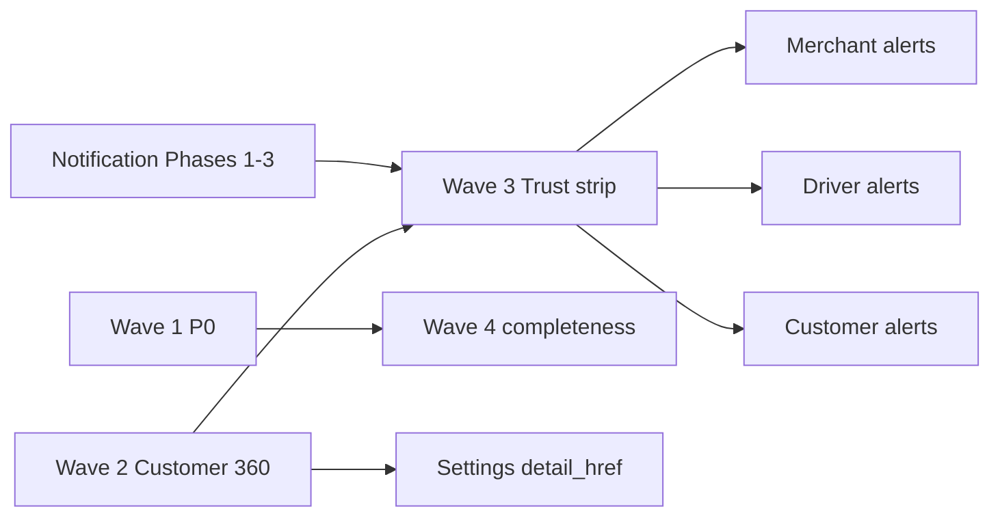

# Admin Partners upgrade plan — Merchants · Drivers · Customers

**Type:** PLAN + AUDIT SSOT  
**Last audited:** 2026-08-08 (pass 1 + pass 2 deep code audit)  
**Status:** Active — Wave 0–3 done; Wave 4 Batch A–G done; remaining P1 open  
**Charter:** [PORTERCHAIN_CHARTER.md](../PORTERCHAIN_CHARTER.md)  
**Related:** [NOTIFICATION_UPGRADE_PLAN.md](../notifications/NOTIFICATION_UPGRADE_PLAN.md) · [FLEETBASE_MODULES.md](../../FLEETBASE_MODULES.md) · Settings Users · Fleetbase-first policy

---

## Project intelligence (how we decide)

PorterChain is a **Transportation Capacity Network**, not a CRM or fleet SaaS. Admin Partners modules exist to **strengthen network nodes** (demand + supply + retail trust) — not to duplicate Fleetbase, Clerk Admin, or Support.

### Charter gates (apply to every gap)

| #   | Question                                                                    | Fail →       |
| --- | --------------------------------------------------------------------------- | ------------ |
| 1   | Which customer problem?                                                     | Defer        |
| 2   | Who benefits? (merchant / driver / dispatcher / admin / receiver)           | Defer        |
| 3   | Raises revenue, retention, trust, utilization, automation, or satisfaction? | Defer        |
| 4   | Strengthens moat (network, relationships, data, trust, execution)?          | UI-only → P2 |
| 5   | Would we build with only **10 paying customers**?                           | Postpone     |
| 6   | Makes PorterChain harder to replace?                                        | Defer        |

### Ownership matrix (do not blur)

| Concern                                | SoT                                       | Partners module role                                    |
| -------------------------------------- | ----------------------------------------- | ------------------------------------------------------- |
| Clerk identity / enroll                | **Settings → Users**                      | Deep-link only; never second invite engine              |
| Merchant commercial CRM                | **Admin Merchants**                       | 360, seats, contracts, AR adjacency                     |
| Driver compliance / profile            | **Admin Drivers**                         | Docs, medical, wallet, invite completion                |
| Driver online / GPS / vehicle registry | **Fleetbase** (+ adapter)                 | Show link + SSO; never rebuild                          |
| Dispatch / assign / exceptions         | **Operations**                            | Deep-link Order 360 / Control Tower                     |
| Retail customer commercial care        | **Admin Customers** (to build)            | 360 + alerts; no Admin create                           |
| Notification delivery                  | **notification_engine** (Phases 1–3 done) | **Consume** records/prefs — don’t re-implement SMTP/FCM |
| Vehicle catalog / retail enablement    | **Settings → vehicles**                   | Merchants bind prefs to catalog IDs                     |
| Support tickets / claims               | **Support / Claims**                      | Deep-link from entity 360                               |

### Shared pattern (all three modules)

After notification Phases 1–3, each entity 360 needs the same thin **Trust strip**:

1. Recent `NotificationRecord`s for `recipient_type` + entity id
2. Read-only PreferenceService (+ quiet hours if set)
3. Deep link to `/notifications` (and devices when role=driver/customer)
4. Open exceptions / care counts via existing APIs — **no second exception engine**

Build once as a reusable Admin component (`EntityAlertsPanel`), wire three times.

---

## Audit verdict (2026-08-08 · pass 1 + pass 2)

| Module        | Network role  | What works                                               | Critical gaps (incl. pass 2)                                                                                                                                   |
| ------------- | ------------- | -------------------------------------------------------- | -------------------------------------------------------------------------------------------------------------------------------------------------------------- |
| **Merchants** | Demand (B2B)  | Fleetbase-free 360; seat-reserve; Settings `detail_href` | Invite copy/docs; CRM convert dead; billing_cycle/stripe_enabled read-only; prefs override weight; SALES_MANAGER ∉ merchants_read; multi-merchant seat blocked |
| **Drivers**   | Supply        | Strong 360; Authorize→FB; Assign→notify                  | Approve `settings=None`; **assign ignores status**; medical holes; **docs dual-schema**; **payouts never created**; online never mirrored inbound              |
| **Customers** | Retail demand | Wave 0 stub; Order embed; self SignUp gates              | No Admin 360; **public track PII**; **website↔portal session broken**; delete orphan; email merge/duplicates; GDPR DSR no hold                                 |

**Counts:** Merchants **34** · Drivers **38** · Customers **33** · Cross **5** · **Stop topology MS 14** → **~124** tracked gaps.

**Intelligence summary (updated):** Stop topology work is **scoped to MS-A only** (Order 360 SoT · retail confirm · honest merchant copy · Admin pick/drop fees). Portal 1:N UI, N:1, and per-stop notify stay **parked**. Partners Wave 1 P0s remain separate; run MS-A in parallel when convenient.

---

## Wave 0 — done

| ID   | Task                                                  | Status |
| ---- | ----------------------------------------------------- | ------ |
| W0-1 | Partners → Customers in `admin-nav.ts`                | Done   |
| W0-2 | Stub `/customers` (Settings users list + plan banner) | Done   |
| W0-3 | Plan SSOT + docs index                                | Done   |

---

## What works (preserve)

### Merchants

- List → 360 tabs; register; approve/suspend; team seats via `ensure_merchant_seat`
- Explicitly Fleetbase-free (`routers/merchants.py`, `merchant360_service`)
- Settings merchant → `detail_href=/merchants/{id}`
- Team panel copy already honest (“No Clerk invitation email”) — register modal is not
- Finance AR tool separate; Merchants invoices tab read-only

### Drivers

- Driver 360 tabs (docs, vehicles, orders, wallet, incidents, CRM, timeline)
- Create path can push Fleetbase when auto-approved + settings present
- Settings **Authorize** correctly calls `approve_driver(..., settings)`
- Medical hard-filter in control-tower scoring / `operations_service` assign
- Assign emits `order.driver_assigned` → notification engine
- Online/GPS correctly omitted from 360 (Fleetbase-first)

### Customers

- Platform self SignUp only: create/authorize/clerk-manage blocked (`customer_self_signup_only`)
- Order 360 `Customer360Tab`: lifetime orders/revenue + 5 recent
- Portal `/v1/customers/me/*` + notification inbox
- Support tickets keyed by `customer_id`
- Engine fan-out `recipient_type=customer` for booking/payment/delivery/claim/support

---

## Gap register (deep audit)

Priorities: **P0** = network/trust break · **P1** = retention/ops with 10 customers · **P2** = polish / dead code.

Evidence paths are repo-relative under `apps/` unless noted.

### Cross-cutting

| ID  | Pri | Gap                             | Evidence                                                                               | Impact                                  | Fix                                  | Wave |
| --- | --- | ------------------------------- | -------------------------------------------------------------------------------------- | --------------------------------------- | ------------------------------------ | ---- |
| X-1 | P1  | No shared entity alerts UI      | No Merchant/Driver/Customer 360 consumer of `NotificationRecord`/prefs                 | Notification upgrade invisible at nodes | `EntityAlertsPanel` + prefs read     | 3    |
| X-2 | P1  | Settings vs Partners dual entry | Settings CreateDriver / AddMerchantSeat vs module modals                               | Incomplete nodes; invite confusion      | CTA matrix + `detail_href` both ways | 4    |
| X-3 | P2  | Heuristic “AI” panels           | `merchant360_service._ai_insights`; `driver360` `_ai()`                                | Charter: AI last                        | Rename Account/Driver insights       | 5    |
| X-4 | P1  | Lifecycle UI swallows errors    | Merchants/Drivers list/detail try/finally no catch                                     | Silent approve/suspend                  | Toast like Team panel                | 4    |
| X-5 | P1  | Write-without-read RBAC pattern | `FLEET_MANAGER`∉`drivers_read`; `SALES_MANAGER`∉`merchants_read` (rbac + `schema.zed`) | Can mutate by ID, 403 on directory      | Align read sets with write           | 1    |

---

### Merchants (demand) — 34 findings (pass 1: M-1…18 · pass 2: M-19…34)

| ID   | Pri | Gap                                                                                                   | Evidence                                                                                          | Impact                                    | Fix                                              | Wave |
| ---- | --- | ----------------------------------------------------------------------------------------------------- | ------------------------------------------------------------------------------------------------- | ----------------------------------------- | ------------------------------------------------ | ---- |
| M-1  | P0  | Register modal promises Clerk invite                                                                  | `admin/.../merchants/page.tsx` copy + `send_invite: true`; API seat-reserves only                 | Ops think email sent; owner never gets it | Seat-reserve SSOT copy; rename flag              | 1    |
| M-2  | P0  | Docs/checklist still say “Clerk invitation”                                                           | `INVITATION_WORKFLOW.md` mixed; `merchant360_service` step “Clerk invitation sent”                | Broken onboarding playbook                | Align docs; rename step “Owner seat reserved”    | 1    |
| M-3  | P1  | `merchant.approved/suspended` silent                                                                  | Emitted in `merchant_service`; **not** in `event_router` watched; no `MERCHANT_SUSPENDED` catalog | Staff miss activate/suspend               | Router → ops/finance in_app; add catalog event   | 4    |
| M-4  | P1  | Unprovisioned signups API dead to UI                                                                  | `GET …/unprovisioned-signups`; `except: return []`; zero Admin callers                            | Orphan Clerk identities invisible         | List UI + surface errors                         | 4    |
| M-5  | P1  | Dual seat UX + UUID modal                                                                             | Settings `AddMerchantSeatModal` requires merchant UUID; Team tab email+role                       | Wrong UUID / incomplete seats             | Merchant picker; deep links                      | 4    |
| M-6  | P1  | `preferred_vehicles` unbound                                                                          | Free JSON on Merchant; Settings tab never edits; catalog = `enabled_retail_vehicle_ids`           | Bad capacity recommendations              | Validate ⊆ catalog; Admin multi-select           | 4    |
| M-7  | P1  | Invoice `total_cents` omits tax                                                                       | `routers/merchants.py` `total_cents=inv.amount_cents`; AR `tax_cents=0`                           | Understated AR                            | Shared serializer amount+tax                     | 4    |
| M-8  | P1  | Outstanding vs Invoices SSOT split                                                                    | Metrics from `CrmInvoice`; Invoices tab from ops `Invoice`                                        | Header ≠ tab totals                       | One SSOT; label CRM separately                   | 4    |
| M-9  | P1  | Orders tab no Order 360 link                                                                          | `[id]/page.tsx` OrdersTab text-only; API returns `id`                                             | Friction into execution                   | `Link` → `/orders/{id}`                          | 4    |
| M-10 | P1  | No alerts/prefs/exceptions on 360                                                                     | No exceptions query by `merchant_id` in merchants UI                                              | Can’t see muted prefs / open exceptions   | EntityAlertsPanel + exception count              | 3    |
| M-11 | P1  | `complete_onboarding` → ACTIVE without Clerk                                                          | `merchant_service.complete_onboarding` forces ACTIVE + approve event                              | Merchant ACTIVE, owner never linked       | Gate on `owner_linked` / keep ONBOARDING         | 4    |
| M-12 | P2  | `merchant.created` audit-only                                                                         | `_audit` only; no `emit_event`                                                                    | Bus/notifications can’t react             | Emit domain event                                | 5    |
| M-13 | P2  | Facets/city half-dead                                                                                 | `merchants.facets` unused; city state no dropdown                                                 | Dead UX                                   | Wire or delete                                   | 5    |
| M-14 | P2  | Subsidiaries / parent / support_tier API-only                                                         | PATCH + GET subsidiaries; no Settings UI                                                          | Half enterprise model                     | UI or document API-only                          | 5    |
| M-15 | P2  | Dead `AdminMerchantService.list_merchants`                                                            | Unused vs `_m360.list_merchants`                                                                  | Drift                                     | Delete or delegate                               | 5    |
| M-16 | P2  | Settings `send_invite: true` for merchant                                                             | `settings.ts` / `clerk_directory` seat-reserve branch                                             | Same invite confusion                     | Stop flag; show `seat_reserved`                  | 1    |
| M-17 | P2  | Heuristic AI insights                                                                                 | See X-3                                                                                           | Trust                                     | Rename                                           | 5    |
| M-18 | P1  | Silent list/bulk lifecycle errors                                                                     | `page.tsx` `runAction` / bulk no catch                                                            | Approve fails invisibly                   | Surface errors                                   | 4    |
| M-19 | P1  | CRM lead/company → merchant convert unreachable                                                       | `convert_lead` / `convert_company_to_merchant` — no router/UI                                     | Sales funnel stops at lead                | Wire POST convert + Admin CTA                    | 4    |
| M-20 | P1  | Convert stamps company ACTIVE_MERCHANT while Merchant PENDING                                         | `crm_contracts.py` convert                                                                        | CRM “converted” ≠ bookable                | Sync company status to merchant ACTIVE           | 4    |
| M-21 | P1  | `billing_cycle` read-only forever                                                                     | Model default MONTHLY; no write path; AR reads it                                                 | Wrong AR periods                          | PATCH + Admin Settings                           | 4    |
| M-22 | P1  | `stripe_enabled` / contracts half-wire                                                                | `merchant_uses_stripe()` reads profile; Admin Settings only terms+credit; Contracts tab list-only | Wrong checkout vs net                     | Toggle stripe + contract create/link             | 4    |
| M-23 | P1  | `recommend_vehicle` overrides weight into prefs                                                       | `booking_flow_service.py` forces first preferred when not in set                                  | Heavy load → sedan prefs                  | Prefs as soft rank among eligible only           | 4    |
| M-24 | P1  | `SALES_MANAGER` write without `merchants_read`                                                        | `rbac.py` + `schema.zed`                                                                          | 403 list; can PATCH by ID                 | Add to merchants_read                            | 1    |
| M-25 | P1  | Portal nav shows all modules to every seat                                                            | `merchant-nav.ts`; no module filter                                                               | Readonly see Book/Team → 403              | Filter by authorize modules                      | 4    |
| M-26 | P1  | `merchant_users.clerk_user_id` globally UNIQUE; portal never sends `X-Merchant-Id`                    | `merchant_models.py`; `MerchantAuthProvider` orgId undefined                                      | Multi-merchant seats impossible           | Composite unique + wire header                   | 4    |
| M-27 | P1  | List filters client-only on limit=500                                                                 | `merchants/page.tsx`; API status/terms/search only                                                | Silent missing rows                       | Server filters + pagination                      | 4    |
| M-28 | P1  | Claims/Support accept `merchant_id`; Admin UIs never set                                              | claims/support pages; no 360 deep-link                                                            | Care adjacency broken                     | `?merchant_id=` from 360                         | 4    |
| M-29 | P1  | Directory outstanding sums all CRM invoices                                                           | `merchant360_service` stats                                                                       | KPI ≠ merchants in view                   | Scope or drop                                    | 4    |
| M-30 | P1  | Seat role holes: invalid→OPS; no last-owner guard; Admin can’t role/remove                            | `team_service.py`; Admin Team add-only                                                            | Orphan org / escalation                   | Reject bad roles; last-owner guard; Admin parity | 4    |
| M-31 | P1  | Admin can’t edit name/phone/HST (portal can)                                                          | Portal Settings vs Admin Settings terms-only                                                      | Ops can’t fix tax/phone                   | Admin editable profile                           | 4    |
| M-32 | P2  | `merchant.booking_created` / `payment_received` emitted, unrouted; `MERCHANT_ACTIVATED` never emitted | booking_service / merchant_ar; event_router                                                       | Incomplete merchant notify                | Route + templates or stop emit                   | 5    |
| M-33 | P2  | `validate_booking` allows ONBOARDING; auth requires ACTIVE                                            | `merchant_sync_service` vs `auth/merchant`                                                        | Dead/confusing path                       | Align ACTIVE-only                                | 5    |
| M-34 | P2  | Thin merchant tests                                                                                   | Smoke only; no convert/billing_cycle/sales_manager/prefs override                                 | Regressions silent                        | Targeted tests M-19–M-30                         | 5    |

---

### Drivers (supply) — 38 findings (pass 1: D-1…22 · pass 2: D-23…38)

| ID   | Pri | Gap                                                     | Evidence                                                                                                                 | Impact                                            | Fix                                                         | Wave |
| ---- | --- | ------------------------------------------------------- | ------------------------------------------------------------------------------------------------------------------------ | ------------------------------------------------- | ----------------------------------------------------------- | ---- |
| D-1  | P0  | Approve from Drivers UI skips Fleetbase                 | `drivers_admin.approve_driver(..., None)`; service only pushes if settings truthy                                        | No `fleetbase_driver_id` → assign/online/map fail | Inject `get_settings` (parity suspend/create/authorize)     | 1    |
| D-2  | P0  | Medical cert: gate yes, Admin toggle no                 | `operations_service` raises `driver_not_medical_certified`; schema has field; SettingsTab **no toggle**; 360 omits field | Cannot certify → medical orders stuck             | Toggle + list badge                                         | 1    |
| D-3  | P0  | Assign API drops medical as 500                         | `admin/dashboard.assign_driver` catches `LookupError` only (not `ValueError`)                                            | Opaque 500 on medical reject                      | Catch ValueError → 400                                      | 1    |
| D-4  | P0  | Assign modal fallback bypasses medical                  | Empty suggestions → `assignableDrivers` **no medical filter**                                                            | Uncertified drivers selectable                    | Filter fallback / pass order context                        | 1    |
| D-5  | P1  | `request_documents` / `reset_password` fake             | `driver_action`: only push/email/sms real; others CRM log + toast “recorded”                                             | False ops confidence                              | Implement or hide / 501                                     | 4    |
| D-6  | P1  | SMS/push often log-only but `{ok:true}`                 | `delivery_service` sms flag / FCM without creds                                                                          | False confidence                                  | Surface delivery status                                     | 4    |
| D-7  | P1  | Dual create paths diverge                               | Drivers `POST /v1/admin/drivers` full vs Settings invite-only PENDING                                                    | Incomplete supply nodes                           | Identity vs profile matrix + deep links                     | 4    |
| D-8  | P1  | Invite endpoint unused by UI                            | `POST /{id}/invite` exists; create invite failures `logger.warning` only                                                 | Stuck PENDING silently                            | Resend invite on 360; surface status                        | 4    |
| D-9  | P1  | `FLEET_MANAGER` write without `drivers_read`            | `rbac.py`: in `drivers`, **not** in `drivers_read`                                                                       | 403 on list while can approve                     | Add to `drivers_read` (+ SpiceDB if needed)                 | 1    |
| D-10 | P1  | No OpenFleetbase on Drivers pages                       | Button elsewhere; `fleetbase_driver_id` unused in UI                                                                     | Can’t jump to execution SoT                       | Badge + OpenFleetbaseButton                                 | 4    |
| D-11 | P1  | `last_active_at` is order proxy                         | `driver360_service._metrics` last order / `updated_at`                                                                   | Misread as GPS online                             | Relabel “Last order” / utilization                          | 5    |
| D-12 | P1  | No prefs / FCM devices on Driver 360                    | Engine ready; Admin Notifications global only                                                                            | Can’t debug missed job push                       | EntityAlertsPanel + devices                                 | 3    |
| D-13 | P1  | `driver_assigned` customer-worded for drivers           | Template “A driver has been assigned to {tracking…}”                                                                     | Supply UX failure                                 | Job template + `/jobs/{id}`                                 | 3    |
| D-14 | P1  | Lifecycle UI swallows errors                            | Detail/list try/finally                                                                                                  | Silent approve                                    | Toast errors                                                | 4    |
| D-15 | P1  | Suspend Fleetbase sync weak                             | `toggle_driver_online(False)` only; exceptions swallowed                                                                 | May stay assignable in FB                         | Adapter inactive; fail visibly                              | 4    |
| D-16 | P2  | `drivers.facets` unused                                 | Client export; page computes client-side                                                                                 | Dead API                                          | Use or drop                                                 | 5    |
| D-17 | P2  | Legacy `api.drivers` / `approveDriver`                  | `lib/api.ts` unused vs `lib/drivers.ts`                                                                                  | Confusion                                         | Remove                                                      | 5    |
| D-18 | P2  | Unused `AdminDriverService.list_drivers`                | Router uses Driver360Service                                                                                             | Drift                                             | Delete                                                      | 5    |
| D-19 | P2  | List N+1 metrics                                        | `_row` → `_metrics` per driver; `limit=500`                                                                              | Slow at scale                                     | Aggregate light DTO                                         | 5    |
| D-20 | P2  | Scoring seeds PC `is_online`                            | `scoring.py` before Fleetbase positions                                                                                  | Ranking skew                                      | Prefer adapter online                                       | 5    |
| D-21 | P2  | Email action uses `delivery_update`                     | Wrong template category                                                                                                  | Ops message copy wrong                            | Dedicated template                                          | 5    |
| D-22 | P2  | Approve verb inconsistent                               | Create auto-approve syncs FB; Drivers Approve does not; Authorize does                                                   | Same word, different sync                         | One approve impl requiring Settings                         | 1    |
| D-23 | P0  | Assign ignores driver **status**                        | `operations_service._assign_driver_no_commit` — medical only, no `APPROVED` check                                        | Can assign PENDING/SUSPENDED/REJECTED             | Reject unless APPROVED (+ onboarded)                        | 1    |
| D-24 | P0  | Wallet/earnings credit with **no payout create path**   | `DriverPayout(` never constructed outside model; finance only lists                                                      | Balances/UI lie; no cash-out ledger               | Payout workflow → debit → paid; 360 via finance service     | 1    |
| D-25 | P0  | Document dual schema / verify–reject–expire half-states | Portal `documents[license].status`; Admin `documents.files[]` no status; verify flips booleans only                      | Pending forever; expired still verified           | One model + statuses; verify/reject/expiry job              | 1    |
| D-26 | P1  | Fleetbase online never mirrored inbound                 | Webhook maps assignment only; ShiftService outbound                                                                      | Local `is_online` stale                           | Webhook/poll → mirror or stop reading local                 | 4    |
| D-27 | P1  | Assign/scoring skip compliance beyond medical           | No license/insurance/bg hard-filter; portal `require_fully_onboarded` unused by dispatch                                 | Non-compliant APPROVED suggested/assigned         | Hard-filter incomplete verification                         | 4    |
| D-28 | P1  | Scoring: empty vehicle set / fake ETA / skills opaque   | No hard exclude empty class; `DEFAULT_ETA_MIN=25`; skills in documents only                                              | Wrong-class / no-GPS rank high                    | Hard-fail required class; exclude no-position; Admin skills | 4    |
| D-29 | P1  | Vehicle attach/detach never syncs Fleetbase             | Vehicles on create only; GET only; deactivate no unlink                                                                  | Stale FB vehicle                                  | Attach/detach → adapter push/unlink                         | 4    |
| D-30 | P1  | Soft delete / reject / rehire incomplete                | Settings delete → SUSPENDED only; no REJECTED API                                                                        | Ambiguous lifecycle                               | Explicit deactivate/reject/rehire                           | 4    |
| D-31 | P1  | Claims/support incomplete on Driver 360                 | Claim no `driver_id` (join current assignee); incidents ignore SupportTicket                                             | Under-report after reassign                       | Snapshot driver_id; include tickets                         | 4    |
| D-32 | P1  | Tax UI is hard-coded 13% estimate                       | `DriverFinanceService._tax_summary`                                                                                      | Misleading compliance                             | Label estimate; collect tax profile                         | 5    |
| D-33 | P1  | No tests for approve→FB or assign status/medical        | Scoring medical unit only                                                                                                | Regressions ship                                  | Integration tests Wave 1 gates                              | 1    |
| D-34 | P2  | Phone uniqueness gap                                    | Email unique; phone nullable no unique                                                                                   | SMS to wrong driver                               | Normalize + unique/warn                                     | 5    |
| D-35 | P2  | Invite accept relies on email rebind                    | No `pending:{email}` on invite                                                                                           | Edge race on login                                | pending marker + metadata.driver_id                         | 5    |
| D-36 | P2  | Admin vs portal earnings dual truth                     | Admin from DriverPayout (empty); portal wallet txns                                                                      | Different money views                             | Admin use DriverFinanceService                              | 4    |
| D-37 | P2  | Push tokens not on Driver 360                           | Mobile registers devices; Admin devices global only                                                                      | Can’t see if driver pushable                      | Device count/last_seen on 360                               | 3    |
| D-38 | P2  | `drivers.ts` omits medical + invite                     | API has medical on verify; client/360 omit                                                                               | Type-unsafe Admin medical                         | Align types + payload                                       | 1    |

---

### Customers (retail) — 33 findings (pass 1: C-0…11 · pass 2: C-12…29+)

| ID   | Pri | Gap                                                | Evidence                                                                                        | Impact                                             | Fix                                                 | Wave                                                 |
| ---- | --- | -------------------------------------------------- | ----------------------------------------------------------------------------------------------- | -------------------------------------------------- | --------------------------------------------------- | ---------------------------------------------------- |
| C-0  | P0  | Admin **delete** customer still allowed            | `DELETE …/settings/users/customer` → `delete_clerk_user`; deactivate has **no customer branch** | Wipe Platform Clerk; DB row orphaned → broken auth | Block retail delete **or** full privacy tombstone   | 1                                                    |
| C-0b | P0  | Latent `_provision_from_clerk` customer branch     | Early raise on create, but provision path still coded                                           | Future refactor re-opens Admin provision           | Delete branch or assert unreachable                 | 1                                                    |
| C-1  | P1  | No Admin Customer 360                              | No `/customers/[id]`                                                                            | Can’t care outside Order context                   | Thin 360 page                                       | 2                                                    |
| C-2  | P1  | No `/v1/admin/customers`                           | Stub uses Settings users shape; fake invite/access labels                                       | Wrong contract                                     | `CustomerAdminService` list+detail                  | 2                                                    |
| C-3  | P1  | No notification consumer on customer               | Engine fan-out yes; Admin entity UI no; portal inbox only                                       | Can’t see muted prefs / failed pushes              | EntityAlertsPanel                                   | 3                                                    |
| C-4  | P1  | Settings customer row no `detail_href`             | Drivers/merchants have it; customer omits                                                       | Dual-entry dead-end                                | `detail_href=/customers/{id}`                       | 2                                                    |
| C-5  | P1  | Order Customer tab no profile deep-link            | Merchant/Driver tabs link out; Customer360Tab does not                                          | Order embed dead-end                               | Link `/customers/{id}` + clerk status               | 2                                                    |
| C-6  | P1  | Claims not filterable by customer                  | `ClaimFilters` has merchant/driver, not customer; Claim has no FK                               | Care adjacency broken                              | Filter via `order.customer_id`                      | 4                                                    |
| C-7  | P1  | Directory status cosmetic                          | Always authorized/active; invite forced accepted                                                | Misleading identity health                         | Real Clerk-linked vs orphan                         | 2                                                    |
| C-8  | P2  | Support/Claims deep-links from Customers           | Support filter exists; stub doesn’t link                                                        | Tickets orphaned from Partners                     | `/support?customer_id=` + claims search             | 5 · **Done** (care tab + header links, 2026-08-12)   |
| C-9  | P2  | Stub search ≠ Settings filters                     | Local search vs API search                                                                      | Two UX modes                                       | Share table after C-2                               | 5 · **Done** (API search + facets, 2026-08-12)       |
| C-10 | P2  | Anemic Customer model                              | No name/status; display = email/reference                                                       | Thin profile                                       | Derive from Clerk/email; don’t invent CRM           | 5 · **Partial** (derive display_name; no CRM status) |
| C-11 | P2  | Portal prefs/devices unused                        | APIs exist; customer app inbox only                                                             | Retail can’t self-manage channels                  | Thin prefs UI                                       | 5                                                    |
| C-12 | P0  | **Public tracking returns full pickup/dropoff**    | `GET /v1/orders/{tracking}` no auth; `TrackingService._order_response_from_order`               | Anyone with TN gets address PII                    | Public snapshot city/status/ETA only; auth for full | 1                                                    |
| C-13 | P0  | Website → portal quote/session handoff broken      | Website `pc_anon_session`; customer portal booking never sends session id; different ports      | Orphan quotes; lost checkout                       | Signed handoff `?quote_id=` / shared cookie         | 1                                                    |
| C-14 | P1  | Same email → duplicate Customers                   | `email` indexed not unique; upsert matches `clerk_user_id` only                                 | Split history/AR/support                           | Email merge orphans; unique partial index           | 2                                                    |
| C-15 | P1  | Booking upsert overwrites email unchecked          | `customer_service.upsert` sets email; `get_or_create` checks mismatch                           | Clerk↔DB desync                                    | Apply email-identity rules in upsert                | 2                                                    |
| C-16 | P1  | Visitor merge emits event only                     | `merge_to_customer` no `customer_id` on VisitorSession                                          | CRM can’t resolve visitor→customer                 | Persist FK / merge table                            | 4                                                    |
| C-17 | P1  | `porterchain_user_id` not set on customer ensure   | `_refresh_account_role_hint` skips customer                                                     | Authz drift                                        | Set FK on ensure + backfill                         | 4                                                    |
| C-18 | P1  | No Stripe Customer id / saved PM                   | Checkout email-only; no `stripe_customer_id` on Customer                                        | No wallet; Admin blind                             | Store Stripe Customer id; 360 read-only link        | 4                                                    |
| C-19 | P1  | GDPR DSR no legal hold vs Admin delete             | `request_customer_deletion` event-only; delete ignores DSR                                      | Wipe during 30-day SLA                             | `privacy_status` hold; block delete                 | 1                                                    |
| C-20 | P1  | Privacy export thin                                | Profile + 200 orders; no payments/tickets/prefs                                                 | Incomplete DSAR                                    | Parity export + tests                               | 4                                                    |
| C-21 | P1  | Portal support/rebook/privacy APIs unused          | `customerApi` stubs; no UI                                                                      | Self-serve care missing                            | Wire UI + fix TS types                              | 4                                                    |
| C-22 | P1  | Admin Orders no `customer_id` filter               | OrderFilters has merchant/driver only                                                           | Can’t list all orders for 360                      | Add filter + query param                            | 2                                                    |
| C-23 | P1  | `identity_conflict` unmapped in `require_customer` | Can 500 for staff Clerk on customer portal                                                      | Bad UX / monitoring                                | Map → 403                                           | 4                                                    |
| C-24 | P1  | Support/lead/rebook races                          | No idempotency; lead every booking; rebook vehicle from pickup                                  | Dupes; empty rebook vehicle                        | Idempotency-Key; lead upsert; quote vehicle         | 4                                                    |
| C-25 | P1  | `customer_reference` no unique-retry               | 8-hex; set once in confirmation                                                                 | Rare paid checkout abort                           | Retry on IntegrityError                             | 4                                                    |
| C-26 | P1  | OpenAPI ↔ portal TS drift                          | Dashboard `bookings`/`stats` omitted; rebook thin; privacy absent                               | Silent data drop                                   | Sync types + CI contract                            | 4                                                    |
| C-27 | P2  | No Admin `customers` SpiceDB module                | schema.zed / rbac have merchants/drivers only                                                   | 360 will over-open or ad-hoc                       | Add `customers`/`customers_read` before API         | 2                                                    |
| C-28 | P2  | Prefs defaults push ON before consent              | `_default_channel_flags`; ensure only on GET prefs (never called)                               | Push before opt-in                                 | Transactional email on; push off until device       | 5                                                    |
| C-29 | P2  | Portal gate / receiver track UX                    | Support/rebook skip `require_customer_portal_ready`; track has dashboard CTA                    | Confusion receiver vs account                      | Gate mutators; receiver mode UX                     | 5                                                    |

**Identity leak check:** create / authorize / clerk-manage for customers = **blocked**. Residual P0 = **delete**, latent provision, **public track PII**, **session handoff**.

**Reuse for Customer 360:** Order `customer_360` builder · Support `customer_id` · NotificationRecord · Settings directory as identity SoT · **never** portal `/me/*` as Admin API.

---

## Surface map (Customers today)

| Layer                           | Status                                                                    |
| ------------------------------- | ------------------------------------------------------------------------- |
| Partners nav `/customers`       | Directory + KPI stats + identity/DSR facets via `/v1/admin/customers`     |
| `/customers/[id]`               | Tabbed 360: Overview · Orders · Care · Billing · Trust · Activity · Tasks |
| Admin API `/v1/admin/customers` | list + stats + detail + orders + care + invoices + payments               |
| Settings Users → Customer       | Read-only; `detail_href=/customers/{id}`                                  |
| Order embed `customer_360`      | Lifetime + 5 recent + profile deep-link                                   |
| Portal `/v1/customers/me/*`     | Self-service only                                                         |
| Notifications                   | Engine yes · Admin `EntityAlertsPanel` on Trust tab                       |
| Support by `customer_id`        | Care tab + header deep-link                                               |
| Claims by customer              | Care tab via order join + header deep-link                                |

**Retail care 360 (2026-08-12):** Admin Customers is a full Partners care module (read + CRM notes/tasks). Still **no** Admin create/invite.

---

## Dual-path matrices

### Merchants

| Job                 | Merchants module      | Settings → Users        |
| ------------------- | --------------------- | ----------------------- |
| Create org + owner  | Register merchant     | Cannot create org       |
| Add teammate        | Team tab (email+role) | UUID + seat (confusing) |
| Open profile        | `/merchants/[id]`     | `detail_href` ✓         |
| Unprovisioned Clerk | API only              | Not surfaced            |

### Drivers

| Job                        | Drivers module                    | Settings → Users       |
| -------------------------- | --------------------------------- | ---------------------- |
| Full onboard + optional FB | AddDriverModal                    | —                      |
| Identity invite only       | —                                 | CreateDriver → PENDING |
| Approve + FB sync          | **Broken** (`settings=None`)      | Authorize ✓            |
| Assign status gate         | **Missing** (D-23) — medical only | —                      |
| Open Fleetbase             | Missing                           | Missing on Drivers     |
| Payouts / docs             | List empty; dual schema           | Portal pending_review  |

### Customers

| Job           | Partners | Settings               |
| ------------- | -------- | ---------------------- |
| List          | Stub     | Directory              |
| Create/invite | Never    | Blocked                |
| Detail 360    | Missing  | No href                |
| Delete        | —        | **Still allowed (P0)** |

---

## Fleetbase-first compliance

| Area                            | Verdict                                                            |
| ------------------------------- | ------------------------------------------------------------------ |
| Merchants rebuild dispatch/GPS  | Correctly absent                                                   |
| Drivers omit live online in 360 | Compliant                                                          |
| Drivers Approve sync            | **Non-compliant** (D-1)                                            |
| Assign status gate              | **Non-compliant** (D-23) — can assign non-APPROVED                 |
| Assign → Fleetbase bridge       | Compliant when ids present                                         |
| Online mirror inbound           | **Done** (D-26) — presence webhook + live roster prefer            |
| OpenFleetbase on Drivers        | Gap (D-10)                                                         |
| Customers live map / assign     | Correctly out of scope                                             |
| Public track PII                | **Trust/compliance break** (C-12) — not Fleetbase but retail trust |

---

## Execution roadmap

```text
Wave 0   Customers nav + stub                         ✓ done

Wave 1   Network / identity / privacy trust (P0)       ✓ done
         D-1 approve → Fleetbase (+ D-22/D-33/D-38)
         D-2 medical toggle · D-3 assign 400 · D-4 modal medical
         D-23 assign requires APPROVED
         D-24 payout create path (or hide empty wallet UI)
         D-25 document schema unify (minimal: verify updates portal status)
         D-9 + M-24 + X-5 write/read RBAC align
         M-1/M-2/M-16 invite SSOT
         C-0/C-0b delete + latent provision
         C-12 public track PII split
         C-13 website↔portal session/quote handoff
         C-19 DSR hold blocks Admin delete

Wave 2   Customers commercial slice (P1)              ✓ done
         C-27 SpiceDB customers module first
         C-2 admin list API · C-1 360 shell
         C-4/C-5/C-7/C-14/C-15/C-22 identity + orders filter

Wave 3   Trust strip (shared P1)                      ✓ done
         X-1 EntityAlertsPanel → M-10, D-12, C-3, D-37
         D-13 driver_assigned job copy

Wave 4   Node completeness (remaining P1)             ✓ DONE
         Batch A ✓ X-4/M-18/D-14 errors · M-9 order links · D-10 Fleetbase
                   M-3 lifecycle notify · D-5 hide fake · D-8 resend invite
         Batch B ✓ M-4 unprovisioned UI · M-7/M-8 AR SSOT · M-11 owner gate
                   C-6 claims by customer_id
         Batch C ✓ M-5 merchant picker · M-28 care deep-links · X-2 dual entry
                   D-15 suspend FB warning · C-16 visitor.customer_id
         Batch D ✓ M-6 preferred_vehicles · M-19/M-20 CRM convert · M-21 billing_cycle
                   (+ M-31 phone/HST patch) · C-17 customer FK · D-6 delivery status
         Batch E ✓ M-23 soft-rank · M-22 stripe+contract create · M-29 ops AR stats
                   D-27 compliance assign/score · C-23 identity_conflict · D-7 dual-create links
         Batch F ✓ M-30 seat roles/last-owner · M-27 server list filters · D-28 empty-class/no-GPS
                   D-36 finance earnings SSOT · C-24 lead upsert/rebook/idem · C-25 cust ref retry
         Batch G ✓ M-25 nav by modules · M-26 multi-seat unique + X-Merchant-Id
                   D-29 vehicle attach/detach FB · D-31 claims snapshot + tickets
                   C-18 stripe_customer_id · C-20 privacy export parity
         Batch H ✓ M-31 company_name Settings · D-26 presence mirror + live online
                   D-30 deactivate/reject/rehire · C-21/C-26 customer care + TS contracts

Wave 5   Charter hygiene / dead code (P2)
         X-3, M-12–17, M-32–34, D-11, D-16–21, D-32, D-34–35, C-8–11, C-28–29

MS-A     **DONE** — stop topology truth (MS-1, MS-2, MS-3, MS-14, MS-6)
MS-B/C   **PARKED** — reopen only after explicit go
```

### Dependency graph



---

## Success metrics

| Metric                                                             | Target   | Wave          |
| ------------------------------------------------------------------ | -------- | ------------- |
| Drivers Approve → `fleetbase_driver_id` when bridge on             | 100%     | 1             |
| Assign rejects non-APPROVED + medical → 400                        | Yes      | 1             |
| Public track response has no full street addresses                 | Yes      | 1             |
| Website quote continues in portal with same session/quote          | Yes      | 1             |
| Zero Clerk-invite promises on merchant register/docs               | Yes      | 1             |
| Retail Admin delete blocked or DSR-held + tombstoned               | Yes      | 1             |
| SALES_MANAGER / FLEET_MANAGER can list their modules               | Yes      | 1             |
| Document verify updates shared status (portal+Admin)               | Yes      | 1             |
| Payout create path exists or wallet UI labeled “no payouts yet”    | Yes      | 1             |
| `/customers/[id]` shows orders + Clerk                             | Yes      | 2             |
| Entity alerts on Merchant / Driver / Customer 360                  | Yes      | 3             |
| `preferred_vehicles` ⊆ catalog; recommend never overrides capacity | Yes      | 4             |
| Invoice total includes tax; outstanding SSOT labeled               | Yes      | 4             |
| Order 360 shows compliance `stops[]` (not quote-only)              | Yes      | **MS-A**      |
| Retail confirm copies quote stops → order → Fleetbase              | Yes      | **MS-A**      |
| Merchant multi mode labeled as N×1:1 (not multi-stop)              | Yes      | **MS-A**      |
| Admin pick/drop fee counts match typed stops                       | Yes      | **MS-A**      |
| Customer/merchant 1:N booking UI                                   | Deferred | MS-B (parked) |

---

## Explicit non-goals

- Rebuilding Fleetbase dispatch, online state, GPS, vehicle registry, POD
- SocketCluster / Fleetbase HTTP from Admin frontends
- Admin-created retail customers / Clerk invitations for customers
- Second notification engine or SMTP secrets in SystemConfig
- Selling Phase 3 “AI insights” as intelligence
- Merging Support/Claims into entity modules
- Subsidiaries/parent enterprise UI until a paying need (M-14 deferred OK)
- N:1 / merchant hub_spoke book UI / retail multi-stop UI / per-stop notify — **parked (MS-B+)** until MS-A exits
- Replacing Fleetbase per-stop POD with a PC stop engine

---

## Stop topology — committed plan (first step only)

**Status:** **MS-A done** · MS-B / MS-C **parked**  
**Strategy:** Truth sync first — not all-in multi-stop product. No new portal 1:N UI, no N:1, no per-stop notify, no Stop table in this step.

### Decision (locked)

| Do now (MS-A)                               | Do **not** do yet                                            |
| ------------------------------------------- | ------------------------------------------------------------ |
| One stop SoT on Order 360                   | Customer multi-stop book UI · website booking (removed)      |
| Retail confirm → compliance stops           | Merchant “real hub_spoke” book mode                          |
| Honest merchant copy (Multi parcel = N×1:1) | Route-import multi-pickup / N:N                              |
| Admin builder correct pick/drop fee counts  | N:1 order_kind · per-stop notifications · DOMAIN Stop entity |

**SoT:** `compliance_metadata.stops[]` (typed + sequenced). Legacy `additional_stops` = derived / fallback only. Execution + POD stay in **Fleetbase**.

### Support reality (unchanged)

| Mode    | Customer | Merchant book                | Route import | Admin       | After MS-A                       |
| ------- | -------- | ---------------------------- | ------------ | ----------- | -------------------------------- |
| **1:1** | Yes      | Yes                          | Yes          | Yes         | Still yes                        |
| **1:N** | No       | No (N×1:1, **honest label**) | Yes          | `hub_spoke` | 360 + sync **truthful**          |
| **N:N** | No       | No                           | No           | Yes         | Fees **correct**; 360 sees stops |
| **N:1** | No       | No                           | No           | No          | Still deferred                   |

---

### MS-A — implementation checklist (only active work)

| ID        | Task                                                                                                                                       | Where                                              | Exit criteria                                                           |
| --------- | ------------------------------------------------------------------------------------------------------------------------------------------ | -------------------------------------------------- | ----------------------------------------------------------------------- |
| **MS-1**  | Order detail / 360 resolve stops: `compliance.stops` → else order legacy `additional_stops` → else quote                                   | `platform_detail.py` (+ drawer/StopsTab if needed) | Admin-built hub_spoke shows intermediate stops in Order 360             |
| **MS-2**  | On retail confirm, write quote `additional_stops` (and/or build minimal `stops[]`) onto `order.compliance_metadata` before Fleetbase push  | `confirmation_service.py`                          | Quote with extras → order compliance non-empty → adapter gets waypoints |
| **MS-3**  | Relabel merchant book mode `"multi"` → **“Multiple deliveries (separate orders)”**; short helper that this is **not** one multi-stop route | `BookDeliveryClient.tsx` (+ nav copy if any)       | No UI claims “multi-stop” for `confirm_multi`                           |
| **MS-14** | One-line glossary in merchant bulk/book: Route import = one 1:N order · Multi = N×1:1 · Classic bulk = N×1:1                               | Merchant bulk + book banners                       | Three paths distinguishable in UI                                       |
| **MS-6**  | Admin `order_builder`: set `total_pickups` / `total_drops` from typed stop counts (not only `len(additional_stops)`)                       | `order_builder_service.py`                         | N:N / hub_spoke GTA extra pick/drop fees match stop types               |

**Explicit MS-A non-goals:** new booking UIs · changing `confirm_multi` to one order · route-import rewrite · marketing site SEO rewrite · notification catalog changes · Fleetbase mapper rewrites (unless confirm payload broken).

**Test plan (MS-A)**

1. Admin create `hub_spoke` → open `/orders/{id}` Stops tab → middles visible.
2. (If quote has `additional_stops` in API) confirm retail booking → order `compliance_metadata` has stops → Fleetbase payload has waypoints (adapter test or log).
3. Merchant book “Multiple deliveries” copy visible; still creates N orders.
4. Admin `multi_pickup_delivery` quote/create → pricing metadata `total_pickups` ≥ 2 when ≥2 pickups.

---

### Parked (do not schedule until MS-A done + explicit go)

| Phase    | IDs                           | When to reopen                                                                 |
| -------- | ----------------------------- | ------------------------------------------------------------------------------ |
| **MS-B** | MS-4, MS-5, MS-7, MS-8, MS-13 | Paying need for merchant/retail **1:N product** (or cut marketing claims only) |
| **MS-C** | MS-9…MS-12                    | Hygiene after MS-B or quiet sprint                                             |

Full audit matrix + evidence for parked items: kept below as reference only.

---

### Reference — full MS gap register (audit)

| ID      | Pri | Gap                                           | Phase                |
| ------- | --- | --------------------------------------------- | -------------------- |
| MS-1    | P0  | Order 360 ignores `compliance_metadata.stops` | **MS-A**             |
| MS-2    | P0  | Retail confirm drops quote stops              | **MS-A**             |
| MS-3    | P0  | Merchant “Multi parcel” ≠ multi-stop          | **MS-A** (copy only) |
| MS-14   | P1  | Bulk / import / multi path confusion          | **MS-A** (copy only) |
| MS-6    | P1  | Admin N:N undercharges pickups                | **MS-A**             |
| MS-4    | P1  | N:1 unsupported                               | Parked               |
| MS-5    | P1  | Route import loses multi-pickup               | Parked               |
| MS-7    | P1  | Website/customer vs marketing                 | Parked               |
| MS-8    | P1  | No per-stop notifications                     | Parked               |
| MS-13   | P1  | Merchant book unused `additional_stops`       | Parked               |
| MS-9…12 | P2  | Catalog / domain / packages / board heuristic | Parked               |

### Key files (MS-A)

| Task         | Path                                                                      |
| ------------ | ------------------------------------------------------------------------- |
| MS-1         | `apps/api/.../order_engine/platform_detail.py` · Admin Order 360 Stops UI |
| MS-2         | `apps/api/.../booking_engine/confirmation_service.py`                     |
| MS-3 / MS-14 | `apps/merchant-portal/.../BookDeliveryClient.tsx` · bulk page copy        |
| MS-6         | `apps/api/.../admin_engine/order_builder_service.py`                      |

---

## Key files

| Area                 | Path                                                                             |
| -------------------- | -------------------------------------------------------------------------------- |
| Plan + audit SSOT    | `docs/ops/ADMIN_PARTNERS_UPGRADE_PLAN.md`                                        |
| Nav / stub           | `apps/admin/src/lib/admin-nav.ts` · `…/customers/page.tsx`                       |
| Merchants            | `routers/merchants.py` · `merchant_service.py` · `merchant360_service.py`        |
| Drivers              | `routers/drivers_admin.py` · `driver_service.py` · `driver360_service.py`        |
| Assign medical       | `operations_service.py` · `routers/admin/dashboard.py` · `AssignDriverModal.tsx` |
| Customer Order embed | `order_engine/platform_detail.py` · `OrderDetailView.tsx`                        |
| Identity             | `routers/admin/settings.py` · `clerk_directory_service.py`                       |
| Notifications        | `notification_engine/event_router.py` · prefs · templates                        |
| RBAC                 | `admin_engine/rbac.py` · `authz/schema.zed`                                      |

---

## Checklist

- [x] W0 Customers nav + stub
- [x] Pass 1 deep audit → register
- [x] Pass 2 deeper audit (portal/CRM/assign/privacy/payouts) → M-19…34, D-23…38, C-12…29
- [x] Stop topology audit → MS register; **MS-A committed, MS-B/C parked**
- [x] **MS-A** (MS-1, MS-2, MS-3, MS-14, MS-6)
- [x] **W1 P0** — D-1/D-2/D-3/D-4/D-9/D-22/D-23/D-24/D-25/D-33/D-38 · M-1/M-2/M-16/M-24 · X-5 · C-0/C-0b/C-12/C-13/C-19
- [x] **W2** — C-27 SpiceDB · C-2 admin API · C-1 360 · C-4/C-5/C-7/C-14/C-15/C-22
- [x] **W3** — X-1 EntityAlertsPanel · M-10/D-12/C-3/D-37 · D-13 job_assigned
- [ ] **W4** — Batch A–G ✓ (… · M-25 · M-26 · D-29 · D-31 · C-18 · C-20); remaining P1
- [ ] W5 P2
- [ ] MS-B / MS-C — only after explicit go

---

## Pass 2 audit scope (what was newly searched)

| Lens                  | Result                                                                                  |
| --------------------- | --------------------------------------------------------------------------------------- |
| Portal ↔ Admin parity | Merchant nav/roles; driver docs/wallet; customer support/rebook unused                  |
| CRM / sales funnel    | Lead→merchant convert dead over HTTP                                                    |
| Dispatch / scoring    | Status gate missing; compliance beyond medical; fake ETA                                |
| Money                 | Merchant billing_cycle/stripe; driver payouts never created; Stripe customer id missing |
| Privacy / trust       | Public track PII; GDPR DSR hold; privacy export thin                                    |
| Identity continuity   | Website session handoff; email merge; visitor merge no-op                               |
| Authz                 | SALES_MANAGER / FLEET_MANAGER write-without-read                                        |
| Tests                 | Missing for approve→FB, assign status, privacy, convert                                 |
